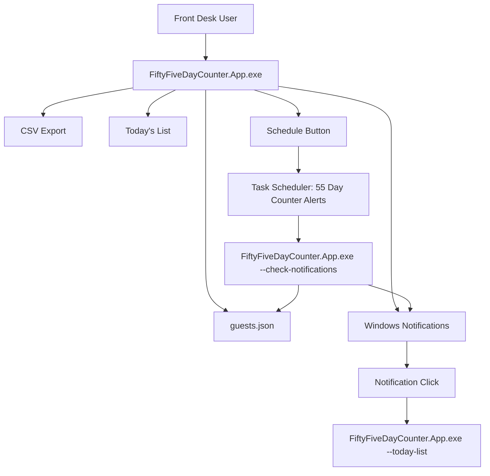

# 55 Day Counter System Architecture

## Purpose

55 Day Counter is a local Windows desktop app for tracking hotel guest 55-day cycles. Staff enter guest name, room number, and check-in date. Check-in counts as day 1:

```text
55th day = check-in date + 54 days
notification date = 55th day - 5 days
```

## Product Architecture

The final product is **.NET only**.

```text
src/FiftyFiveDayCounter.App      WinForms UI, notifications, scheduling
src/FiftyFiveDayCounter.Core     date/status/business rules
src/FiftyFiveDayCounter.Storage  JSON storage
installer/phase1-bootstrap       bootstrap installer and uninstall scripts
legacy/powershell-pilot          archived pilot only, not shipped
scripts/Build-Release.ps1        self-contained release builder
dist/                            generated output, ignored by Git
```

The release build publishes a self-contained `win-x64` app so hotel PCs do not need the .NET runtime installed separately.

## Installed Runtime

Install location:

```text
%LOCALAPPDATA%\55DayCounter
```

Main executable:

```text
FiftyFiveDayCounter.App.exe
```

Installer behavior:

- removes known old 55 Day Counter folders, shortcuts, scheduled tasks, and processes
- removes old local guest data for a fresh install
- copies the self-contained .NET app
- creates Desktop and Start Menu shortcuts
- installs an uninstaller shortcut
- logs to `%LOCALAPPDATA%\55DayCounter\install.log`

Uninstaller behavior:

- removes installed app files and local data
- removes known 55 Day Counter shortcuts
- removes current and legacy scheduled task names
- stops known .NET and legacy PowerShell app processes
- logs to `%TEMP%\55DayCounter-uninstall.log`

## Component Flow



## Data Storage

Guest data is stored locally as JSON:

```text
%LOCALAPPDATA%\55DayCounter\guests.json
```

Each record contains:

```text
Id
GuestName
RoomNumber
CheckInDate
CheckOutDate
NotifyDate
Status
Notes
```

Dates are local calendar dates. Complete and Cancel permanently remove a guest record after confirmation.

## Notification Architecture

The app has one scheduled notification task:

```text
55 Day Counter Alerts
```

The task action is:

```text
%LOCALAPPDATA%\55DayCounter\FiftyFiveDayCounter.App.exe --check-notifications
```

The installed app owns task creation through the `Schedule` button. The installer only removes old tasks during cleanup and does not create a default notification schedule.

The first app launch sends a test notification and can open Windows Notification settings. Windows notification permission cannot be silently granted by the app.

Scheduled check troubleshooting log:

```text
%LOCALAPPDATA%\55DayCounter\notification-check.log
```

## Release Outputs

`scripts/Build-Release.ps1` creates:

```text
dist\dotnet-app\FiftyFiveDayCounter.App.exe
dist\55DayCounterInstaller.exe
dist\55DayCounterInstaller.sha256
dist\release\
dist\script-install\
```

The installer executable is also copied to:

```text
installer\phase1-bootstrap\55DayCounterInstaller.exe
```

## Operational Notes

- No internet connection is required after the release is built.
- The app installs per-user under `%LOCALAPPDATA%` to avoid administrator rights.
- Company PCs may still block unsigned executables, Windows notifications, or scheduled tasks by policy.
- The legacy PowerShell pilot is retained only for reference and rollback analysis; it is not part of the final release payload.
