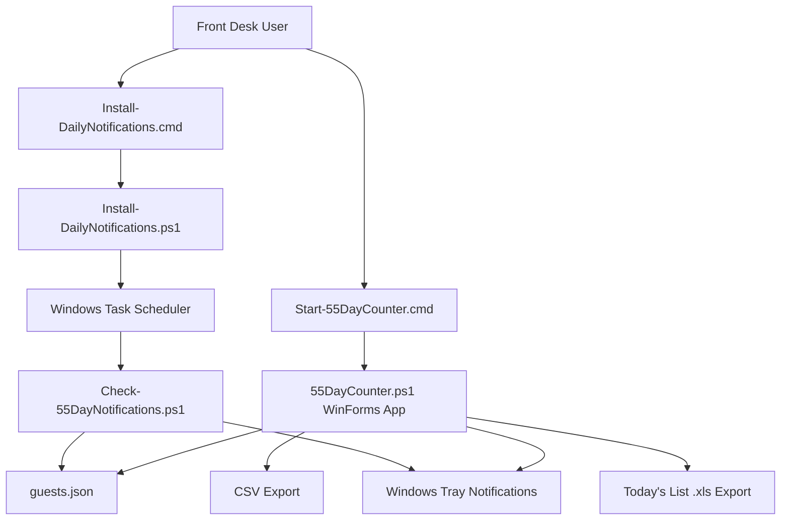

# 55 Day Counter System Architecture

## Purpose

55 Day Counter is a local Windows desktop app for tracking guest 55-day cycles. Staff enter a guest name, room number, and check-in date. The app calculates the guest's 55th day by counting the check-in date as day 1, so:

```text
55th day = check-in date + 54 days
notification date = 55th day - 5 days
```

The app supports active tracking, due-soon review, completion, cancellation, local notifications, and Excel/CSV exports.

## Codebase Model

The repo now separates the working pilot, the .NET product path, and release tooling:

```text
assets/                    shared app icon/image assets
docs/                      architecture, installation, roadmap, checklists
installer/phase1-bootstrap current installer, uninstaller, and backup scripts
legacy/powershell-pilot    Phase 1 PowerShell WinForms app
samples/                   sanitized example data
scripts/                   build, run, and test helpers
src/                       Phase 2 .NET WinForms app, core rules, storage
tests/                     automated tests
dist/                      generated release output, ignored by Git
```

## Runtime Model

The current deployable pilot is built with Windows PowerShell and WinForms. The Phase 2 product rewrite lives under `src/` and is built with .NET WinForms.

Current Phase 1 entry points:

- `installer/phase1-bootstrap/55DayCounterInstaller.exe`: current one-step installer for hotel PCs.
- `installer/phase1-bootstrap/Install-55DayCounter.cmd`: script installer fallback.
- `installer/phase1-bootstrap/Install-55DayCounter.ps1`: copies app files, creates shortcuts, creates/preserves local data, and installs daily notifications.
- `legacy/powershell-pilot/Start-55DayCounter.cmd`: launches the Phase 1 desktop app.
- `legacy/powershell-pilot/55DayCounter.ps1`: main Phase 1 WinForms application.
- `installer/phase1-bootstrap/Install-DailyNotifications.cmd`: installs a Windows Scheduled Task for daily notification checks.
- `installer/phase1-bootstrap/Install-DailyNotifications.ps1`: creates or updates the scheduled task.
- `legacy/powershell-pilot/Check-55DayNotifications.ps1`: lightweight notification checker used by the scheduled task.

Phase 2 source entry points:

- `src/FiftyFiveDayCounter.App`: .NET WinForms UI.
- `src/FiftyFiveDayCounter.Core`: date, status, and business rules.
- `src/FiftyFiveDayCounter.Storage`: JSON storage compatible with the pilot data format.
- `tests/FiftyFiveDayCounter.Core.Tests`: rule regression tests.

No internet connection is required.

The recommended production install location is:

```text
%LOCALAPPDATA%\55DayCounter
```

This avoids needing administrator rights on the hotel PC. The one-step installer preserves an existing `guests.json` file during upgrades.

## Component Overview



## Main App Responsibilities

`55DayCounter.ps1` owns the interactive workflow:

- Load guest records from `guests.json`.
- Add new guest cycles.
- Edit guest name, room number, check-in date, and notes.
- Recalculate 55th day and notification date after check-in date changes.
- Mark cycles as completed.
- Mark cycles as canceled.
- Search and filter records.
- Show color-coded cycle status.
- Show manual alert checks.
- Export all records to CSV.
- Preview and export `Today's List`.

## Data Storage

Guest data is stored locally in:

```text
guests.json
```

This file is created next to the app scripts.

Each guest record contains:

```text
Id
GuestName
RoomNumber
CheckInDate
CheckOutDate
NotifyDate
Status
Notes
LastNotifiedFor
```

The app treats dates as local calendar dates. This avoids timezone shifting problems because the business rule is date-based, not time-based.

## Status Rules

The app calculates display status from the current local date and the guest's 55th day.

```text
Completed: manually completed
Canceled: manually canceled
Overdue: today is after the 55th day
Due Today: today is the 55th day
Due Soon: today is within 1-5 days before the 55th day
Active: more than 5 days before the 55th day
```

Completed and canceled cycles do not trigger notifications or appear in `Today's List`.

## Notification Architecture

There are two notification paths.

### 1. Main App Notifications

While `55DayCounter.ps1` is open:

- The app checks notifications when it starts.
- The app checks again every hour.
- The user can also click `Check Alerts`.
- Alerts are shown through a Windows tray balloon notification.

The app notifies guests who are:

- Due today, or
- Due within the next 5 days.

`LastNotifiedFor` stores the checkout date plus the calendar date of the reminder. This allows one reminder per day during the 5-day warning window without repeating endlessly within the same day.

### 2. Scheduled Daily Notifications

If the user runs:

```text
Install-DailyNotifications.cmd
```

Windows Task Scheduler creates a daily 9:00 AM task named:

```text
55 Day Counter Alerts
```

That task runs:

```text
Check-55DayNotifications.ps1
```

The checker reads `guests.json`, finds due-today and next-5-days guests, shows a Windows tray notification, updates `LastNotifiedFor`, and exits. It uses the same data lock as the main app so both processes do not write `guests.json` at the same time.

## Today's List Feature

The `Today's List` button builds a focused operational list.

Included records:

- Overdue guests who have not been completed or canceled.
- Guests whose 55th day is today.
- Guests whose 55th day is within the next 5 days.

Excluded records:

- Completed cycles.
- Canceled cycles.
- Guests due more than 5 days later.

The user sees a preview table first. From that preview, they can download an Excel-readable `.xls` file.

## Notification Testing Steps

Use these steps later to verify notifications safely.

### A. Test Manual App Notifications

1. Open the app with `Start-55DayCounter.cmd`.
2. Add a test guest.
3. Set the check-in date to 50 days ago.
4. Save the guest.
5. Confirm the guest status shows `Due Soon`.
6. Click `Check Alerts`.
7. Confirm a Windows notification appears with guest name, room number, and 55th day.

Expected result:

```text
Guest is included because check-in + 54 days is 4 days from today.
```

### B. Test Due Today

1. Add another test guest.
2. Set the check-in date to 54 days ago.
3. Save the guest.
4. Confirm the guest status shows `Due Today`.
5. Click `Check Alerts`.
6. Confirm a Windows notification appears.
7. Click `Today's List`.
8. Confirm the guest appears in the preview.

Expected result:

```text
Guest is due today because check-in day is counted as day 1.
```

### C. Test Next 5 Days List

1. Add test guests with check-in dates 49, 50, 51, 52, 53, and 54 days ago.
2. Click `Today's List`.
3. Confirm guests due today and within the next 5 days are shown.
4. Click `Download Excel`.
5. Open the saved `.xls` file in Excel.

Expected result:

```text
The preview and exported file contain only guests due today or in the next 5 days.
```

### D. Test Completed And Canceled Exclusion

1. Select a due-soon guest.
2. Click `Complete`.
3. Click `Today's List`.
4. Confirm the completed guest is no longer listed.
5. Repeat with `Cancel Cycle`.

Expected result:

```text
Completed and canceled cycles do not appear in Today's List and do not trigger notifications.
```

### E. Test Scheduled Daily Notifications

1. Double-click `Install-DailyNotifications.cmd`.
2. Open Windows Task Scheduler.
3. Find the task named `55 Day Counter Alerts`.
4. Confirm it is scheduled daily at 9:00 AM.
5. Right-click the task and choose `Run`.
6. Confirm due-soon or due-today notifications appear.

Expected result:

```text
The scheduled task runs Check-55DayNotifications.ps1 and shows Windows notifications without opening the full app.
```

### F. If Notifications Do Not Appear

Check these items:

- Windows Focus Assist / Do Not Disturb is turned off.
- Notifications are enabled in Windows Settings.
- The guest is not completed or canceled.
- The guest's 55th day is today or within the next 5 days.
- `guests.json` exists next to the scripts.
- The scheduled task points to the correct script path.
- The app or scheduled task has permission to show tray notifications.

## Future Improvements

Recommended future enhancements:

- Store data in SQLite instead of JSON for stronger durability.
- Add backup and restore buttons.
- Add audit fields such as created date, updated date, completed date, and canceled date.
- Add a cancellation reason.
- Add a dashboard calendar view.
- Add daily summary notification counts.
- Package the app as a signed `.exe` installer.
